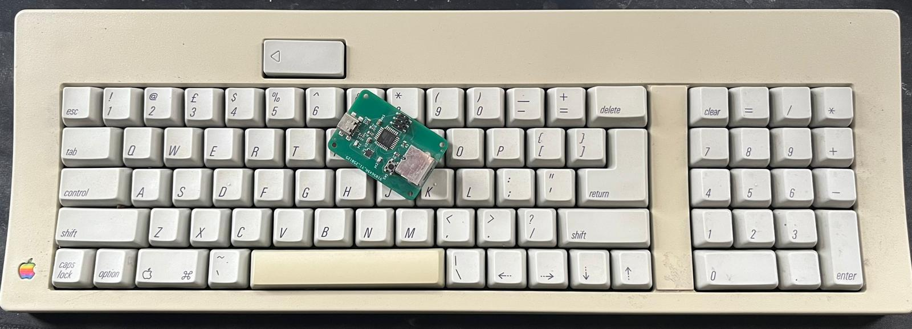
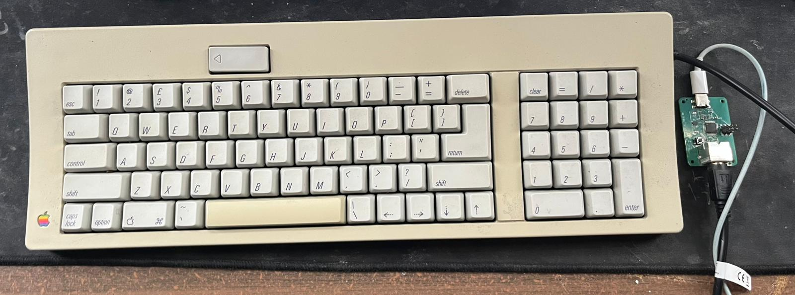
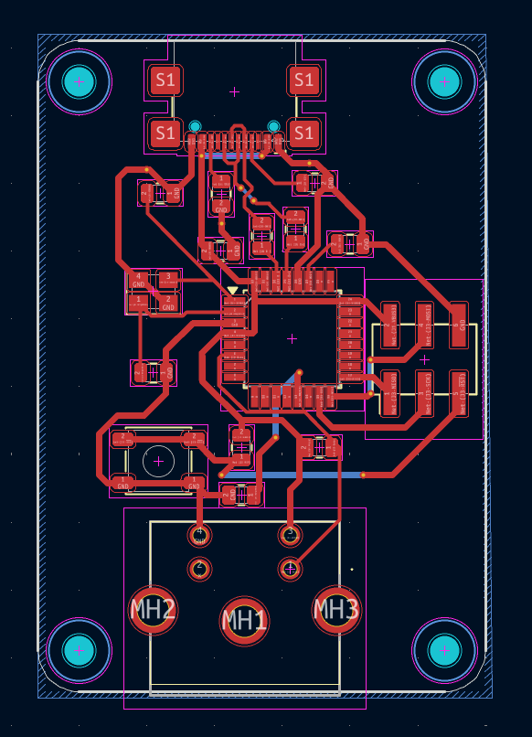

# ADB2USBC

**ADB-to-USB Converter for Apple Desktop Bus Keyboards**

ADB2USBC is a small PCB that allows vintage Apple ADB keyboards to be used as modern USB HID keyboards. The board is built around an ATmega32U2 microcontroller and is intended to run the ADB-to-USB converter firmware from the TMK Keyboard Firmware project.

## Overview

This project contains the hardware design files for an ADB-to-USB converter board.

Features:

* Supports Apple Desktop Bus (ADB) keyboards
* USB HID keyboard output
* ATmega32U2 microcontroller
* Compatible with TMK's ADB-to-USB converter firmware
* USB DFU bootloader support for firmware flashing

## Firmware

This repository does **not** include firmware.

The board is designed to run the ADB-to-USB converter implementation provided by the TMK Keyboard Firmware project:

TMK Keyboard Firmware:
https://github.com/tmk/tmk_keyboard

Please refer to the TMK documentation for building and flashing firmware.

## Hardware

The repository contains:

* PCB design files
* Schematic
* Manufacturing outputs (Gerber files) can easily be created in KiCad

## Pictures

### Assembled Board

### PCB

