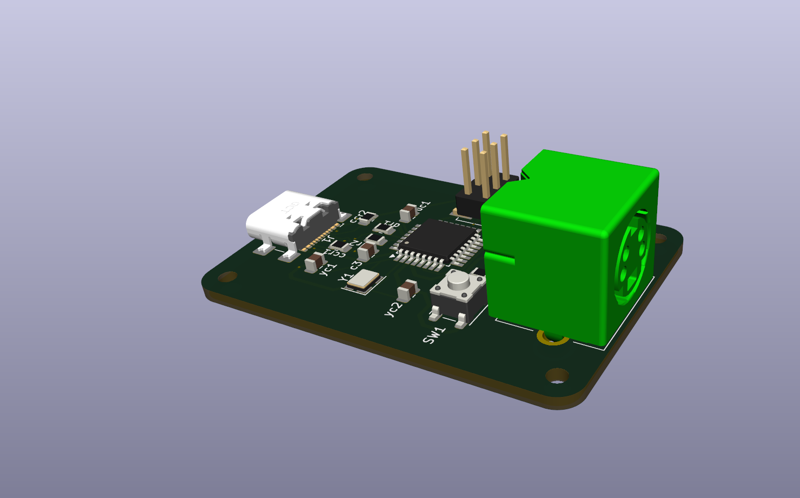

# ADB2USBC

**ADB-to-USB Converter for Apple Desktop Bus Keyboards**

ADB2USBC is a small PCB that allows vintage Apple ADB keyboards to be used as modern USB HID keyboards. The board is built around an ATmega32U2 microcontroller and is intended to run the ADB-to-USB converter firmware from the TMK Keyboard Firmware project.

## Overview

This project contains the hardware design files for an ADB-to-USB converter board.

Features:

* Supports Apple Desktop Bus (ADB) keyboards
* USB HID keyboard output
* ATmega32U2 microcontroller
* Compatible with TMK's ADB-to-USB converter firmware
* USB DFU bootloader support for firmware flashing

## Firmware

This repository does not include firmware.

The board is designed to run the ADB-to-USB converter implementation provided by the TMK Keyboard Firmware project:

TMK Keyboard Firmware:
https://github.com/tmk/tmk_keyboard

Please refer to the TMK documentation for building and flashing firmware.

## Hardware

The repository contains:

* KiCad project files
* Schematic
* Bill of Materials (BOM)
* Custom footprint, symbol and 3D model files for the ADB connector

### BOM

A Bill of Materials (BOM) is included for assembly. The provided BOM was created specifically for JLCPCB assembly services and includes the manufacturer part numbers used for the original build. Component availability may change over time, so substitutions may be required.

### Manufacturing

Gerber files are not included in this repository. They can be easily generated from the included KiCad project files using KiCad's built-in fabrication output tools.

### ISP Header

The board includes a standard 6-pin Atmel ISP header for development and debugging purposes.

For normal operation, the ISP header is not required. The ATmega32U2 can be programmed via its USB DFU bootloader, so the header may be removed.

## Pictures

### Assembled Board

### PCB

